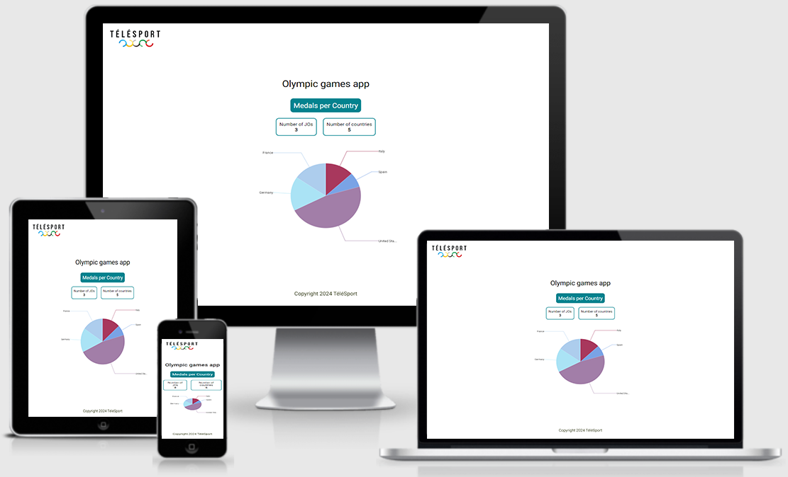

# Projet n°15 : Passer une librairie jQuery vers React

## :mag: Aperçu

## :bookmark_tabs: Sommaire

<ol>
    <li><a href="#sujet">Sujet</a></li>
    <li><a href="#demandes_respecter">Demandes à respecter</a></li>
    <li><a href="#objectifs_projet">Objectifs du projet</a></li>
    <li><a href="#technologies_utilisees">Technologies utilisées</a></li>
    <li><a href="#prerequis">Prérequis</a></li>
    <li><a href="#installation">Installation</a></li>
    <li><a href="#utilisation_siteweb">Utilisation du site web</a></li>
    <li><a href="#auteurs_contributeurs">Auteurs et contributeurs</a></li>
    <li><a href="#licence">Licence</a></li>
</ol>

## :page_facing_up: 1. Sujet 

Vous travaillez depuis quelques mois pour une ESN nommée DelivWeb, spécialisée dans le développement web.

Votre manager, Jeanette, vous a annoncé ce matin le projet sur lequel vous travaillerez par la suite.

Il s’agit d’un nouveau projet pour le compte de la chaîne de télévision TéléSport.

Ces derniers souhaitent créer une nouvelle application web interactive pour préparer les prochains Jeux Olympiques.

## :memo: 2. Demandes à respecter 

-   Faire la partie front-end de l'application web en utilisant Angular.js ;
-   L'application devra être responsive (s'adapter aux différentes tailles d'écrans) ;
-   Utiliser des services pour réaliser les appels HTTP ;
-   Utiliser RxJS et les observables ;
-   Unsubscribe les observables ;
-   Typer le code de manière à ne plus avoir de “any”.

## :checkered_flag: 3. Objectifs du projet 

-   Apprendre à utiliser Angular (gestion des composants, système de routing, utilisation de bibliothèques Angular, etc...);

## :computer: 4. Technologies utilisées 

-   HTML
-   CSS / Sass
-   JavaScript / Angular.js
-   Git & GitHub

## :exclamation: 5. Prérequis 

Aucun

## :wrench: 6. Installation 

-   Cloner ce repository.
-   Pour installer les différents packages, dans le terminal à partir du dossier front-end, exécuter npm install.

## :question: 7. Utilisation du site web 

-   Dans le terminal à partir du dossier front-end, exécuter ng serve ;
-   L'application est disponible a l'adresse suivante : http://localhost:4200/

## :beers: 8. Auteurs et Contributeurs 

Timoté Lancelle : [GitHub](https://github.com/LancelleTimote) / [LinkedIn](https://www.linkedin.com/in/timote-lancelle-devweb/)

## :page_with_curl: 9. Licence 

Distribué sous la licence MIT. Voir le fichier [LICENSE](LICENSE) pour plus d'informations.
